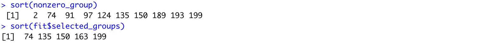

# GVSSB
This is the repository for the paper A Generic Variational Spike-and-Slab Approach for Group Variable Selection.

To install the package, run the following code:

```
library(devtools)
install_github(repo="HowardGech/GVSSB")
```

If the package $\texttt{devtools}$ is not available in your R version,  download the zip file and unfold it into a user-specified folder (for example, GVSSB), and install it by:

```
install.packages("/path/to/folder/GVSSB", repos = NULL, type = "source")
```
The package includes three main functions:

GVSSB: This function computes the variational parameters for a given prior. It supports Gaussian prior, Laplace prior, and student T prior, and performs the variational Bayesian inference to estimate the model parameters.

predict.GVSSB: This function provides predictions of the response vector based on a fitted GVSSB model and a covariate matrix. It uses the estimated model parameters to generate predictions for new data points.

cv.GVSSB: This function performs cross-validation to select the prior with the smallest loss. It compares the performance of different priors by evaluating the loss function on validation data. Note that the function does not select the hyperparameters of the slab prior, as they are updated automatically within the GVSSB function.

# Examples of the Utility of the package

To illustrate the functions of the GVSSB package, let's walk through an example step-by-step.

First, we generate the covariate matrix (X) and coefficients (beta) as follows:
```
library(GVSSB)

n <- 200
G <- 200
p_i <- 5
p <- G * p_i
X <- mvtnorm::rmvnorm(n, sigma=diag(p))

k <- 10
beta <- rep(0,p)
nonzero_group <- sample(1:G, k)
for(index in nonzero_group){
    beta[p_i * (index - 1) + 1:p_i] <- runif(p_i, -1, 1)
}
```

Next, we define the group index and simulate the response vectors (Y):
```
groups <- rep(1:G, each = p_i)
snr <- 1
Y <- X %*% beta + rnorm(n, 0, sd = sqrt(var(X %*% beta) / snr)
```
Now, let's use the simulated data to make an inference based on different priors:

```
fit.Gaussian <- GVSSB(X, Y, groups, prior = 'Gaussian')
fit.Laplace <- GVSSB(X, Y, groups, prior = 'Laplace')
fit.Cauchy <- GVSSB(X, Y, groups, prior = 'T', nu = 1)
```
Alternatively, we can select the prior using cross-validation:

```
fit <- cv.GVSSB(X, Y, groups, nfolds = 5, loss = 'L2')
```

Here we compare the true nonzero groups and the selected (positive) groups:
```
sort(nonzero_group)
sort(fit$selected_groups)
```


After fitting the GVSSB model, we can use it for prediction:

```
n_test <- 50
X_test <- mvtnorm::rmvnorm(n_test, sigma=diag(p))
predict.GVSSB(fit, X_test)
```
