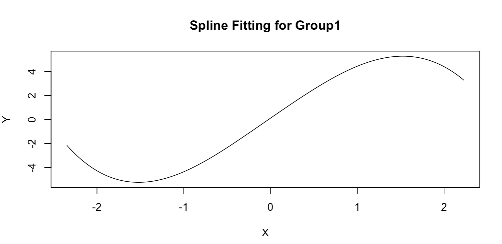

## Sparse Group Linear Models
After model fitting, you can perform prediction using fitted `GVSSB` model and new data, simply by calling the `predict.GVSSB` function:

```r {filename="example - GVSSB prediction"}
n_test <- 50
X_test <- mvtnorm::rmvnorm(n_test, sigma=diag(p))
gvssb.predicted <- predict.GVSSB(gvssb.Laplace, X_test)
```
You may also get the volume of coverage region using the `coverage` function by specifying the fitted model, confidence level and inference type (`group` or `marginal`). If a coefficient vector is provided, it will also provide a vector of logical values indicating whether each coefficient (group) is selected as nonzero.

```r {filename="example - GVSSB coverage"}
gvssb.coverage.group <- coverage(gvssb.Laplace, alpha = 0.95, beta = beta, type = "group")
gvssb.coverage.marginal <- coverage(gvssb.Laplace, alpha = 0.95, beta = beta, type = "marginal")
```
The returned value is a list:
- `regionvol`: A vector of region volumes with length $p$ (for group level) or $G$ (for marginal level)
- `coverindex`: A vector of logical values indicating whether each coefficient or group is selected. Has the same length as `regionvol`.

## Sparse Additive Models
Similarly, the fitted `AMSSB` model can also be used to predict new data with `predict.AMSSB`:

```r {filename="example - AMSSB prediction"}
n_test <- 50
X_test <- mvtnorm::rmvnorm(n_test, sigma = diag(G))
amssb.predicted <- predict.AMSSB(amssb.Laplace, X_test)
```

For a convenience visualization of the fitted `AMSSB` model, you can resort to `plot.AMSSB` given the coefficient index of interest:

```r {filename="example - AMSSB visualization"}
plot.AMSSB(model.Laplace, index = 1)
```
