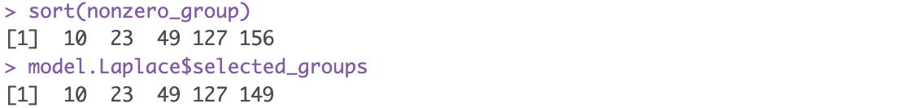

## Sparse Group Linear Models
The `GVSSB` function aims at solving sparse group linear regression problems. For a given prior, including Gaussian prior, Laplace prior, and student T prior, it performs the variational Bayesian inference to estimate the model parameters. The main arguments include:
- `X`: A matrix of covariates, with rows being samples and columns being features.
- `Y`: An outcome vector or matrix with 1 column.
- `groups`: The group indicator vector with length the same length of features.
- `prior`: The slab part of the coefficient prior. To use the Cauchy distribution, set it to `"T"` and also pass `nu = 1`.
Other arguments can be found in its help function by calling `help(GVSSB)`.

`GVSSB` returns a list of values. The fitted coefficients and intercepts can be accessed by `beta` and `intercept`. You can also get the selected group indices by `selected_groups`.

```r {filename="example - sparse group linear model"}
library(GVSSB)
n <- 200
G <- 200
p_i <- 5
p <- G * p_i
X <- mvtnorm::rmvnorm(n, sigma = diag(p))
k <- 5
beta <- rep(0,p)
nonzero_group <- sample(1:G, k)
for(index in nonzero_group){
    beta[p_i * (index - 1) + 1:p_i] <- runif(p_i, -1, 1)
}
groups <- rep(1:G, each = p_i)
Y <- X %*% beta + rnorm(n, 0, sd = 3)
model.Laplace <- GVSSB(X, Y, groups, prior = 'Laplace')
```
One implementation of this example gives:


## Sparse Additive Models

`AMSSB` is a wrapper function for fitting additive models using GVSSB. The main arguments include:
- `X`: A matrix of covariates, with rows being samples and columns being features.
- `Y`: An outcome vector or matrix with 1 column.
- `degree`: The degree of B-splines used to fit the additive models.
- `prior`: The slab part of the coefficient prior.

`AMSSB` also provides other customization arguments, such as `knots` and `Boundary.knots` for user-defined spline settings. See the help function for more information.

```r {filename="example - sparse additive model"}
library(GVSSB)
n <- 200
G <- 300
X <- mvtnorm::rmvnorm(n, sigma=diag(G))
f1 <- function(x) 5 * sin(x)
f2 <- function(x) 2 * (x^2 - 0.5)
f3 <- function(x) 2 * exp(x)
f4 <- function(x) 3 * x
Y <- f1(X[,1]) + f2(X[,2]) + f3(X[,3]) + f4(X[,4]) + rnorm(n, 0, 1)
model.Laplace <- AMSSB(X, Y, prior = 'Laplace')
```


To make prediction using fitted `GVSSB` and `AMSSB` models, please refer to the [Prediction](../prediction) section.

## Selecting Priors with Cross-Validation