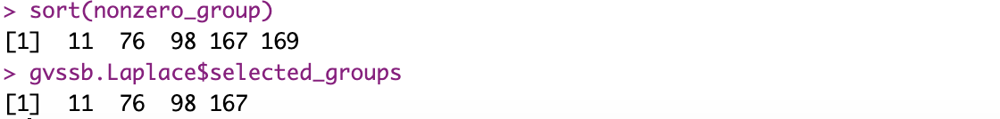

## Sparse Group Linear Models
The `GVSSB` function aims at solving sparse group linear regression problems. For a given prior, including Gaussian prior, Laplace prior, and student T prior, it performs the variational Bayesian inference to estimate the model parameters. The main arguments include:
- `X`: A matrix of covariates in the linear regression problem, with rows being samples and columns being features.
- `Y`: An outcome vector or matrix with 1 column.
- `groups`: The group indicator vector with length the same length of features.
- `prior`: The slab part of the coefficient prior. To use the Cauchy distribution, set it to `"T"` and also pass `nu=1`.
Other arguments can be found in its help function by calling `help(GVSSB)`.

`GVSSB` returns a list of values. The fitted coefficients and intercepts can be accessed by `beta` and `intercept`. You can also get the selected group indices by `selected_groups`.

```r {filename="example of sparse linear model"}
library(GVSSB)
n <- 200
G <- 200
p_i <- 5
p <- G * p_i
X <- mvtnorm::rmvnorm(n, sigma=diag(p))
k <- 5
beta <- rep(0,p)
nonzero_group <- sample(1:G, k)
for(index in nonzero_group){
    beta[p_i * (index - 1) + 1:p_i] <- runif(p_i, -1, 1)
}
groups <- rep(1:G, each = p_i)
Y <- X %*% beta + rnorm(n, 0, sd = 3)
model.Laplace <- GVSSB(X, Y, groups, prior = 'Laplace')
```
One implementation of this example gives:
